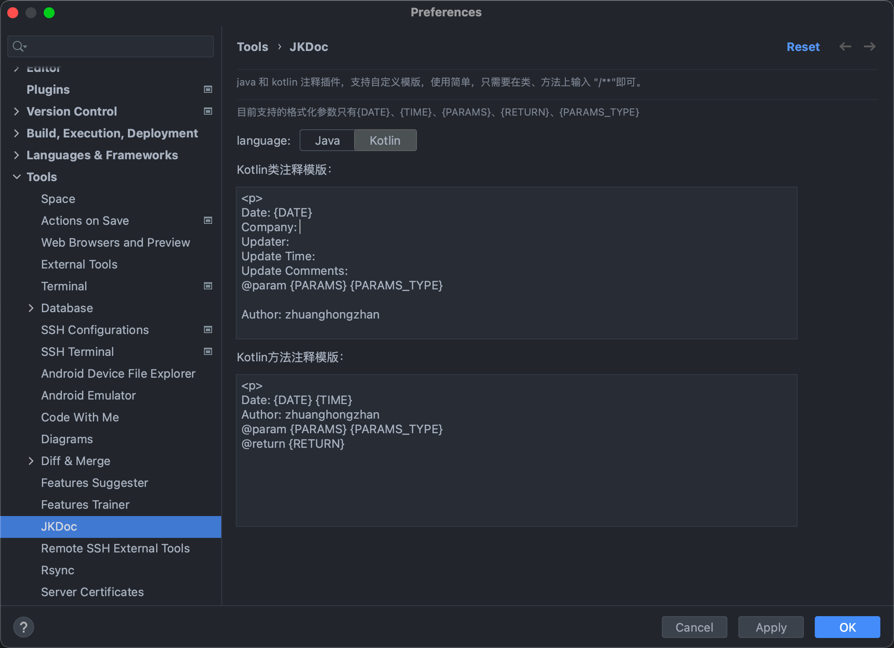
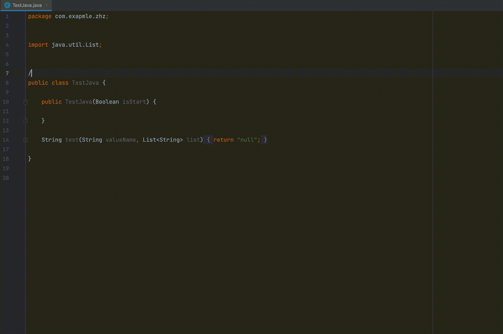
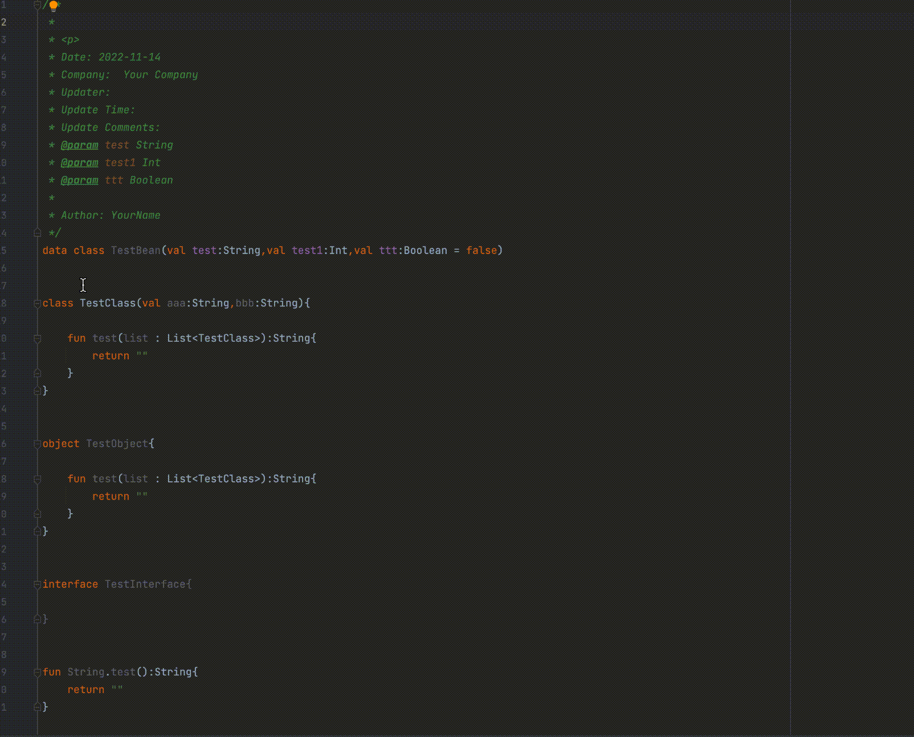

# JKDoc

Plugin for **IntelliJ IDEA** / **Android Studio** , can generate document comments for Java/Kotlin file.<br>
一款 **IntelliJ IDEA** / **Android Studio** 插件，用于生成java、kotlin文件类/方法的注释,模版支持自定义。

# Usage 

**Just press Enter key after `/**`, just like in Java File !!!**
<br>
**在方法和类上方输入`/**` 后回车即可, 像以往使用java注释一样 !!!**

# settings

**Settings/Preferences** | **Tools** | **JKDoc** 
<br>
<br>


# Screenshots




# template
可自行定义模版，目前占位的支持以下几个参数：<br>
- **{DATE}** : 日期格式化，格式为 yyyy-MM-dd
- **{TIME}** : 时间格式化，格式为 HH:mm
- **{PARAMS}** : 参数名称
- **{PARAMS_TYPE}** : 参数类型
- **{RETURN}** ： 返回值类型，目前如果是(kotlin)Unit或(java)Void是不显示的，如果有需要请自行修改

下面这几个模版是我个人用的模版
- **Java Class Template**
```text
<p>
Date: {DATE}
Company: YourCompany
Updater:
Update Time:
Update Comments:
Author YourName
```

<br>

- **Java Method template**
```text
<p>
@param {PARAMS}
@return {RETURN}
@Date: {DATE} {TIME}
@author YourName
```

<br>

- **Kotlin Class Template**
```text
<p>
Date: {DATE}
Company: YourCompany
Updater:
Update Time:
Update Comments:
@param {PARAMS} {PARAMS_TYPE}

Author: YourName
```

<br>

- **Kotlin Method Template**
```text
<p>
Date: {DATE} {TIME}
Author: YourName
@param {PARAMS} {PARAMS_TYPE}
@return {RETURN}
```
<br>


# Thanks
- [zxj5470/BugKotlinDocument](https://github.com/zxj5470/BugKotlinDocument)

