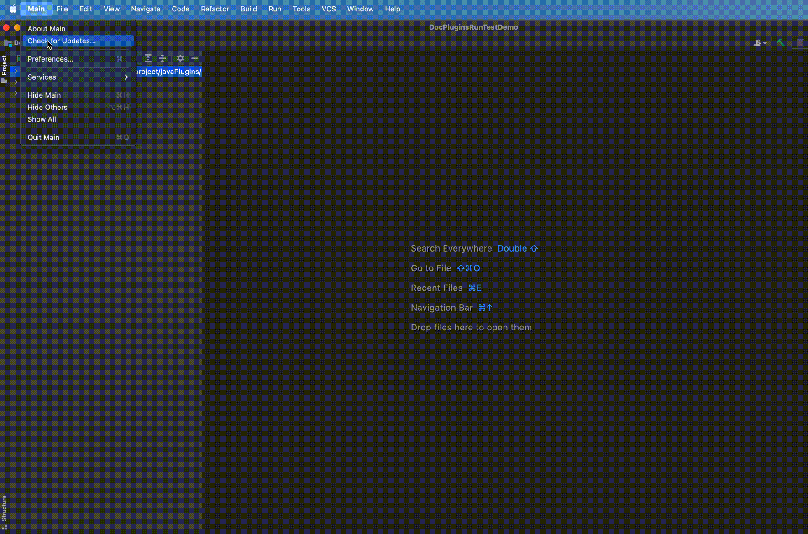

# JKDoc

Plugin for **IntelliJ IDEA** / **Android Studio** , can generate document comments for Java/Kotlin file. 

# Usage 

**Just press Enter key after `/**`, just like in Java File !!!**
 
**在方法和类上方输入`/**` 后回车即可, 像以往使用java注释一样 !!!**

# settings

**Settings/Preferences** | **Tools** | **JKDoc** 
 
 

# Screenshots

# future
- Support for dart

# Thanks
- [zxj5470/BugKotlinDocument](https://github.com/zxj5470/BugKotlinDocument)

